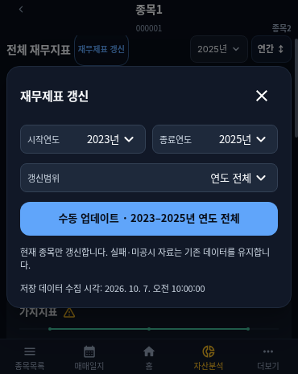
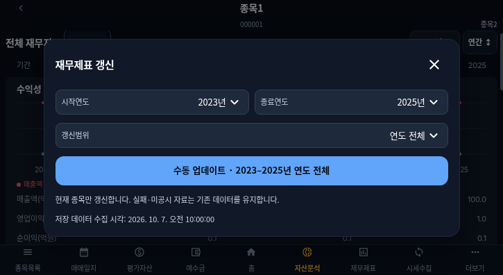
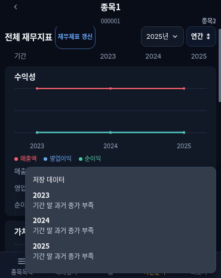
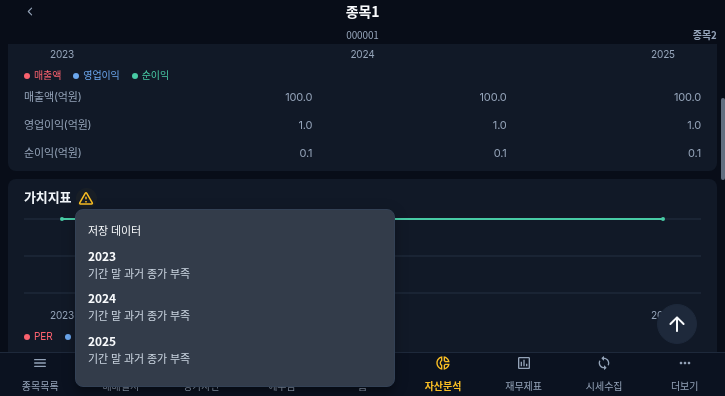

# 10차 재무지표·수동 갱신 개선

기준 main: a9dc5bf (9차 구현 및 1~9차 문서 현행화 반영). 10차 지시가 팝업 저장 조회 기능에 대한 9차 지시를 대체한다.

## 화면과 동작

- 전체 재무지표(14px, 기존 600 굵기), 갱신 버튼, 종료연도 셀렉트, 연간/분기 전환을 한 줄에 표시한다. 기존 종료연도 3년 규칙·URL 호환·종목 이동 조건을 유지한다.
- 공통 팝업의 서비스 디자인 토큰을 사용한다. 시작·종료연도는 동일 폭 2열, 갱신범위는 다음 줄이며 36px Small 입력을 사용한다. 저장 데이터 조회 버튼·미리보기·관련 안내는 제거했다. 제목과 닫기 버튼은 고정하고 본문만 스크롤한다.
- 현재 종목의 선택 기간·보고서를 처리한다. 서버 metadata.progress에 currentYear/currentPeriod/stage/completed/total과 보고서 결과를 저장한다. 공시 확인 → 재무제표 수집 → 가치지표 보충 → 보고서 종료를 실제 처리 경계에서 기록한다. 기존 JSON metadata 사용으로 스키마 변경은 없다.
- 화면은 3초 간격으로 상태를 조회하며 입력·실행 버튼을 잠근다. 조회 실패(404 포함)는 작업 완료로 간주하지 않는다. 요청 ID 복원, 팝업 닫힘·재진입 추적과 서버 잠금을 유지한다. FINISHED에만 주기 조회를 종료하고 화면 데이터를 재조회한다.
- 결과 단위는 연도×보고서 1건이다. 공시 확인 완료, 미공시, 공시 수집 실패를 집계하고, 공시 성공 건 중 가치지표 전체 보충 완료와 보충 실패/근거 부족을 별도로 집계한다. 누락된 valuationStatus도 보충 완료로 간주하지 않는다. 미공시와 성공이 섞여도 부분 완료다. 상세 보고서 사유는 접힌 상세 내용에서 보며 보고서 내 중복 문구를 제거한다.
- 가치지표의 연도별 미산출 사유·계산 기준·종가 기준일·공통 안내는 노란 삼각형 버튼의 툴팁으로 이동했다. 터치·클릭·키보드 사용, 바깥 클릭·재클릭·Escape 닫기, 화면 폭 제한과 내부 스크롤을 지원한다. 안내가 없으면 숨긴다.

## 종가 조회 점검

코드 점검에서 모든 오류가 같은 문구로 축약되고, percent-encoded 서비스 키가 다시 인코딩될 수 있으며 XML 오류·단일 결과 객체를 처리하지 못하는 것을 확인했다. 키를 한 번만 인코딩하고 JSON/XML 응답을 분류한다. 요청은 기존 `likeSrtnCd` 필터를 사용하고 응답에서 단축 종목코드를 정확히 검증한다. 최초 10차 PR의 `srtnCd` 요청 변경은 후속 명세 대조에서 정정했다. 조회 상한은 기간 말 다음 날로 보내 상한이 미만 조건인 제공처에서도 기간 말 당일을 포함하고, 응답에서 기간 말 이후 데이터를 제외한다. 재무기간 말 이전 7일 이내 마지막 거래일 비수정 종가만 인정한다.

- 인증·활용 권한: HISTORICAL_PRICE_AUTH / KEY_MISSING / KEY_FORMAT
- 통신: HISTORICAL_PRICE_COMMUNICATION / HTTP
- 호출 제한: HISTORICAL_PRICE_RATE_LIMIT
- 공급자 응답: HISTORICAL_PRICE_PROVIDER / INVALID_RESPONSE
- 조회 결과 없음: HISTORICAL_PRICE_NO_DATA

공급자 상태 코드·오류 종류는 supplemental.errors에 저장하고 구조화된 historical_price_failure 로그에 종목·연도·보고서와 함께 기록한다. URL·인증키·원본 응답은 로그에 넣지 않는다. EPS·주식 수·자본 부족과 가격 실패는 별도 사유로 유지한다. 기존 정상 값·지표별 출처 보존 및 현재가 대체 금지 정책은 유지한다.

**실제 공급자 조회·운영 실패 원인은 미검증이다.** 이 개발 채팅은 이전 게시 버전에 연결되어 허용 도메인이 binaries.prisma.sh뿐이며 2026-10-07 재확인에서도 공식 두 도메인의 CONNECT가 403으로 차단됐다. 이 차단은 개발 환경의 원인이며 운영 API 인증 실패 원인으로 단정하지 않는다. 운영 서버 로그를 읽을 수 있는 연결은 현재 제공되지 않았다. 테스트 응답으로 확인한 코드 결함과 운영 실패 원인을 구분한다. 실제 2024·2025년 종가와 저장 지표/API 대조는 네트워크 적용 후 필요하다.

## 검증·캡처

프론트 TypeScript·빌드, 백엔드 TypeScript·빌드·116개 테스트 통과. 9차 기존 회귀 6개와 10차 기능 8개는 수정 후 통과했으며 한 줄 헤더·툴팁 캡처 검사를 추가 재실행해 2개 통과했다. 기존 8차·가치분석 회귀 28개도 통과했다. 370×465 및 725×396에서 종료연도·종목 이동·분기 유지, 기간 역전, 실패 후 활성화, 재진입·중복 실행, 한 줄 정렬, 36px Small 입력, 터치 툴팁, 서버 단계 표시, 조회 오류 유지, 완료 후 polling 종료, 정상·부분 완료·미공시 결과를 검사한다. 캡처는 API fixture 기반 검증이며 운영 데이터 캡처가 아니다. 서비스 API 모드에 목 fallback을 추가하지 않았다.

운영 환경변수·DB 데이터는 변경하지 않는다. 기존 필수 검사와 자동 병합·Production Deploy 절차를 사용하며 실제 PR·병합 SHA·배포 결과는 완료 보고에 기록한다.

기존 비차단 경고: 프론트 번들 크기 경고와 개발 모드 MainLoadingBar의 render 중 갱신 경고가 검사 로그에 남는다. 이번 작업에서 로딩 표시 공통 로직은 변경하지 않았다.

## 배포 자동화 경합 보완

PR #124의 자동 병합 완료 직후 PR Auto Merge가 같은 PR에 merge를 시도해 405로 실패하고 배포 호출이 생략됐다. 실패 작업 재실행으로 62b0805 배포를 복구했다. 후속 변경은 merge 호출 오류 시 PR을 다시 읽어 실제 병합 완료가 확인된 경우에만 배포 호출을 이어간다. 병합이 확인되지 않은 오류는 계속 실패 처리하며 검사·보호 규칙을 우회하지 않는다.

공공데이터 서비스·오류 코드 출처: https://www.data.go.kr/data/15094808/openapi.do . 종목 LIKE 필터는 기존 9차 요청과 제공처 가이드의 요청/응답 필드 구분을 유지한다. 실제 키의 권한과 공급자 응답은 여전히 미검증이다.

후속 검증: 백엔드 TypeScript·116개 테스트 통과. 요청에 likeSrtnCd가 있고 srtnCd가 없는지, 상한 다음 날과 기간 말 당일 종가·미래 종가 제외를 검사했다. 자동 배포 호출은 정상 병합, 동시 자동 병합, 미병합 오류의 3개 시나리오를 실제 workflow 스크립트로 검증해 통과했다.
