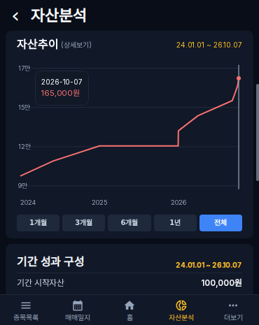
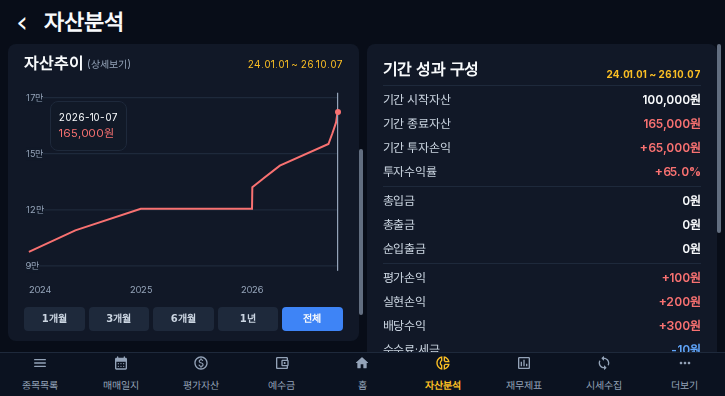
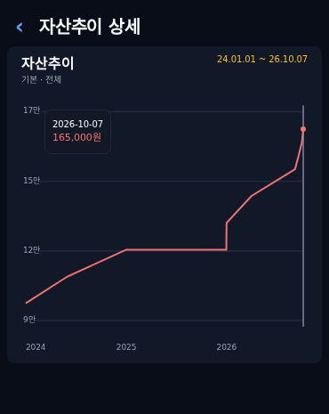
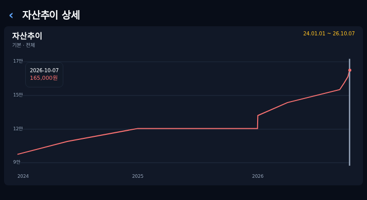
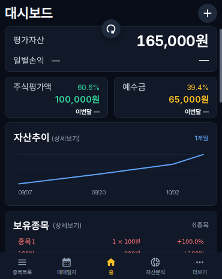
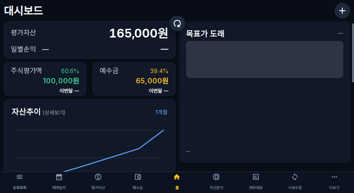
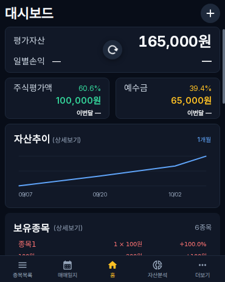
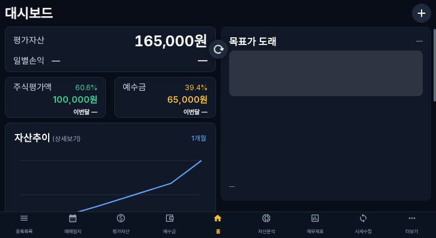

# RoxStock 5차 UI 개선 검증

기준 main: `30bbf72b3ad3cc64065d7d93bfd78af34c12561d` (4차 PR #111 반영).
작업 브랜치: `codex/improvements-phase5-20261007`.
매매일지 성능 추가 계측은 보류했습니다.

## 변경

- 자산분석: 자산추이와 `(상세보기)`를 함께 표시하고 전체 헤더를 상세보기 버튼으로 구성했습니다. 조회 기간은 같은 줄 오른쪽, 기간 선택 버튼은 차트 날짜 아래에 배치했습니다. X축 날짜는 Y축과 같은 중립색이며 기간 성과 날짜는 노란색을 유지합니다.
- 새로고침: 4차 훅에 당김 표시 상태를 연결하고 스크롤 영역 밖 고정 오버레이로 아이콘을 표시합니다. 당기면 내려오고, 취소하면 복귀하며, 실행하면 위로 복귀해 회전합니다. 성공/실패 및 화면·계좌 전환 시 표시 상태를 종료합니다. 기존 요청 잠금·갱신 대상·오류/재시도·메인 로딩바·overscroll contain을 유지합니다.
- 대시보드: 자산추이 `(상세보기)`를 보유종목 상세 텍스트와 같은 11px 중립색·일반 굵기로 표시합니다. 헤더만 `/assets`로 이동합니다. 차트는 버튼의 자식이 아니므로 드래그로 이동하지 않습니다.

거래/손익 계산, API, 캐시 키·무효화, 시세 정책, 차트 데이터·높이·인터랙션, 상세보기 history/복원 코드는 변경하지 않았습니다. 서버·운영 원본 데이터 작업, 병합·배포는 수행하지 않았습니다.

## 검증

로컬 Vite API 모드 + 고정 테스트 데이터, Chromium 153 모바일 에뮬레이션(370×465, 725×396 CSS px) 및 1200×900에서 확인했습니다. 실제 운영 계좌 데이터를 변경하지 않았습니다.

| 검증 | 결과 |
|---|---|
| TypeScript 검사 / 프론트 빌드 / diff check | 통과 |
| 5차 브라우저 테스트 | 최종 대상 14개 통과, 데스크톱 터치 전용 1개 제외; 전체 11개 통과 + 변경/추가 6개 통과(3개 재검증) |
| 4차 초성 검색·시장 달력 단위 테스트 | 2개 통과 |
| 헤더, 하단 기간 버튼, 날짜 색상, 200px 차트 높이 | 세 크기 통과, 커버·태블릿 캡처 확인 |
| 차트 선택점·정확한 툴팁·계좌·기간 전달 | 통과 |
| 화면/브라우저 뒤로가기와 기간·스크롤 복원 | 통과 |
| 홈 헤더 → 현재 계좌 자산분석 / 차트 이동 없음 | 통과 |
| 당김 표시·취소·실행·회전·성공/실패 종료 | 통과 |
| 갱신 중 재당김 중복 방지·기존 콘텐츠·로딩바 종료 | 통과 |
| Chromium trusted touch 입력·44px 헤더/메뉴 유지 | 모바일 설정 두 크기 통과 |
| 종목목록·매매일지 공통 아이콘·취소·콘텐츠 위치 유지 | 세 크기 통과 |

재현 명령:

```sh
npm run typecheck:frontend
npm run build:frontend
node --import tsx --test frontend/tests/unit/improvements-phase4.test.ts
cd frontend
npx playwright test --config=playwright.phase5.config.ts
```

환경에 기본 Playwright Chromium이 없고 다운로드 파일도 유효하지 않아 별도 설치한 Chromium 실행 파일을 `ROX_CHROMIUM_PATH=/tmp/chromium`으로 지정했습니다. 실행 파일이나 설치 패키지는 저장소 의존성에 추가하지 않았습니다. 초기 실행 환경 실패 후 정상 브라우저에서 재검증했습니다.

## 미검증 및 남은 문제

- 실제 휴대폰의 Android Chrome/iOS Safari 및 브라우저 기본 당김 UI와의 실기기 충돌은 미검증입니다. 위 터치 검증은 headless Chromium 에뮬레이션이며 실기기 확인을 대체하지 않습니다.
- API는 테스트 응답으로 검증했습니다. 실제 운영 시세·네트워크·실거래 변경 후 갱신, 운영 브라우저 확인은 미검증입니다.
- 개발 모드에서 `MainLoadingBar`의 다른 컴포넌트 렌더 중 상태 갱신 경고와 Emotion `:first-child` 경고가 관찰됐습니다. 관련 구현은 기준 main 그대로이며 이번 UI 변경에서 수정하지 않았습니다. 이번 테스트에서 기능 실패/로딩 잔류는 없었으나 운영 영향·별도 원인 계측은 수행하지 않았습니다.
- 번들 500KB 경고가 유지됩니다. 이번 작업에서 번들 분할 정책은 변경하지 않았습니다.
- 기존 4차 브라우저 테스트의 노란 X축 기대값은 5차 우선 요구에 맞춰 중립색으로 갱신했습니다.

## 화면 캡처

| 커버 370×465 | 태블릿 725×396 |
|---|---|
|  |  |
|  |  |
|  |  |
|  |  |
