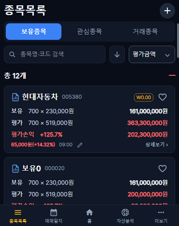
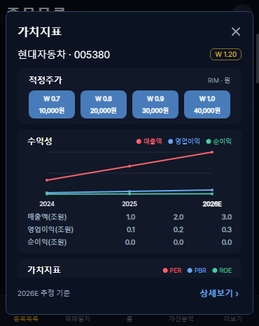
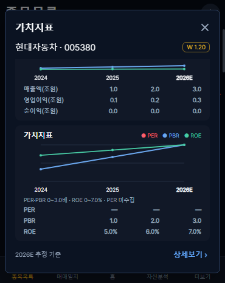
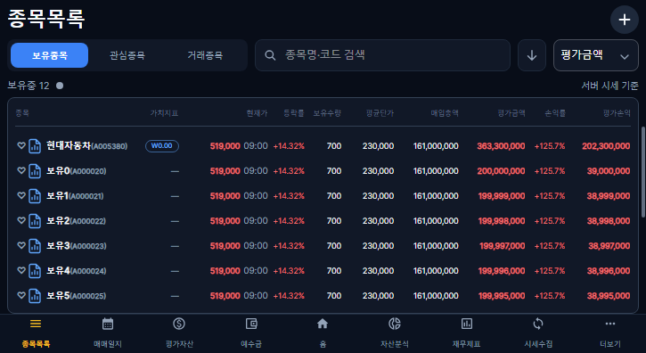
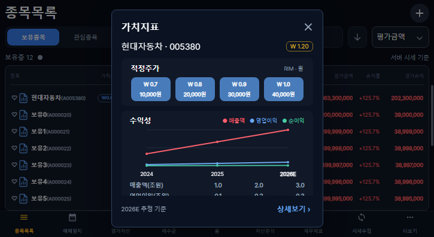
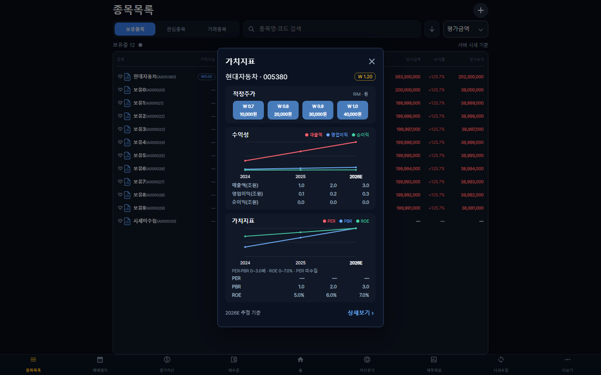
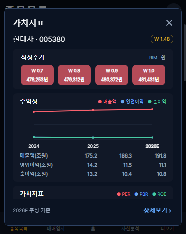

# 14차 검증 (2026-10-08)

- 프론트 TypeScript·빌드 통과. 기존 500kB 번들 경고 유지.
- 기준 문구 단위 검사: 추정/실적/분기/근거 없음 구분.
- Playwright Chromium 모의 API: 370×465, 725×396, 1280×800. 신규 6건 + 13.1차 기존 내비게이션 8건 통과.
- 아이콘 원본 로드/18px/4px 간격, 클릭 격리, 종목명 기존 동작, 즐겨찾기, 실제 선택 ID 요청, 표 기간과 값, 미수집 —, 실패 안내, 고정 제목·하단과 내부 스크롤, 닫기/Escape, 상세보기 후 목록 복귀 검사.
- Figma 전체 콘텐츠는 구성 참고용이며 실제 팝업은 화면 높이에서 상하 16px을 제외한 공간에 제한한다. 이중축 단위·미수집 안내를 실제 범위로 표시한다.
- 커버·태블릿·큰 화면 캡처는 아래 경로에 저장. 모의 API 수치는 검사 전용이며 앱에 포함하지 않음.
- 실기기 터치는 미검증. 운영 배포 결과는 PR 완료 보고에서 기록한다.

로컬 실제 API 읽기 확인: 현대차(005380)의 저장된 2026E 추정 기준과 W/적정주가 표시를 확인했다. 모든 비-GET 요청을 차단해 조회했다. 
